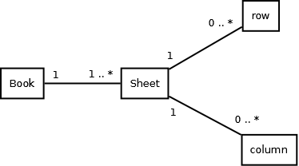

=============
API Reference
=============

.. currentmodule:: pyexcel
.. _api:

This is intended for users of pyexcel.

.. _signature-functions:
Signature functions
====================

.. _conversion-from:

Obtaining data from excel file
-------------------------------

.. autosummary::
   :toctree: generated/

   get_array
   get_dict
   get_records
   get_book_dict
   get_book
   get_sheet

.. _conversion-to:
Saving data to excel file
--------------------------

.. autosummary::
   :toctree: generated/

   save_as
   save_book_as
   
Cookbook
==========

.. autosummary::
   :toctree: generated/

   merge_csv_to_a_book
   merge_all_to_a_book
   split_a_book
   extract_a_sheet_from_a_book

   
Book 
=====

Here's the entity relationship between Book, Sheet, Row and Column

Constructor
------------

.. autosummary::
   :toctree: generated

   Book
   load_book
   load_book_from_memory
   load_book_from_sql

Attribute
------------

.. autosummary::
   :toctree: generated

   Book.number_of_sheets
   Book.sheet_names

Conversions
-------------

.. autosummary::
   :toctree: generated

   Book.to_dict

Save changes
-------------

.. autosummary::
   :toctree: generated

   Book.save_as
   Book.save_to_memory
   Book.save_to_database

Sheet
=====

Constructor
-----------

.. autosummary::
   :toctree: generated/

   Sheet
   load
   load_from_memory
   load_from_sql

Attributes
-----------

.. autosummary::
   :toctree: generated/

   Sheet.row
   Sheet.column
   Sheet.number_of_rows
   Sheet.number_of_columns
   Sheet.row_range
   Sheet.column_range

Iteration
-----------------

.. autosummary::
   :toctree: generated/

   Sheet.rows
   Sheet.rrows
   Sheet.columns
   Sheet.rcolumns
   Sheet.enumerate
   Sheet.reverse
   Sheet.vertical
   Sheet.rvertical

Cell access
------------------

.. autosummary::
   :toctree: generated/

   Sheet.cell_value
   Sheet.__getitem__

Row access
------------------

.. autosummary::
   :toctree: generated/

   Sheet.row_at
   Sheet.set_row_at
   Sheet.delete_rows
   Sheet.extend_rows

Column access
--------------

.. autosummary::
   :toctree: generated/

   Sheet.column_at
   Sheet.set_column_at
   Sheet.delete_columns
   Sheet.extend_columns

Data series
------------

Any column as row name
************************

.. autosummary::
   :toctree: generated/

   Sheet.name_columns_by_row
   Sheet.rownames
   Sheet.named_column_at
   Sheet.set_named_column_at
   Sheet.delete_named_column_at

Any row as column name
************************

.. autosummary::
   :toctree: generated/

   Sheet.name_rows_by_column
   Sheet.colnames
   Sheet.named_row_at
   Sheet.set_named_row_at
   Sheet.delete_named_row_at

   
Formatting
------------------

.. autosummary::
   :toctree: generated/

   Sheet.format
   Sheet.apply_formatter
   Sheet.add_formatter
   Sheet.remove_formatter
   Sheet.clear_formatters
   Sheet.freeze_formatters

Filtering
-----------

.. autosummary::
   :toctree: generated/

   Sheet.filter
   Sheet.add_filter
   Sheet.remove_filter
   Sheet.clear_filters
   Sheet.freeze_filters

Conversion
-------------

.. autosummary::
   :toctree: generated/

   Sheet.to_array
   Sheet.to_dict
   Sheet.to_records

Anti-conversion
----------------

.. autosummary::
   :toctree: generated/

   dict_to_array
   from_records

Transformation
----------------

.. autosummary::
   :toctree: generated/

   Sheet.transpose
   Sheet.map
   Sheet.region
   Sheet.cut
   Sheet.paste
        

Save changes
--------------

.. autosummary::
   :toctree: generated/

   Sheet.save_as
   Sheet.save_to_memory
   Sheet.save_to_database

Row access
============

.. currentmodule:: pyexcel.sheets
                   
.. autosummary::
   :toctree: generated/

   NamedRow
   NamedRow.format
   NamedRow.select

Column access
===============

                   
.. autosummary::
   :toctree: generated/

   NamedColumn
   NamedColumn.format
   NamedColumn.select

Data formatters
================

.. currentmodule:: pyexcel.formatters

.. autosummary::
   :toctree: generated/

   ColumnFormatter
   NamedColumnFormatter
   RowFormatter
   NamedRowFormatter
   SheetFormatter
   

Data Filters
===============

.. currentmodule:: pyexcel.filters

.. autosummary::
   :toctree: generated/

   ColumnFilter
   SingleColumnFilter
   OddColumnFilter
   EvenColumnFilter
   RowFilter
   SingleRowFilter
   OddRowFilter
   EvenRowFilter
   RegionFilter
