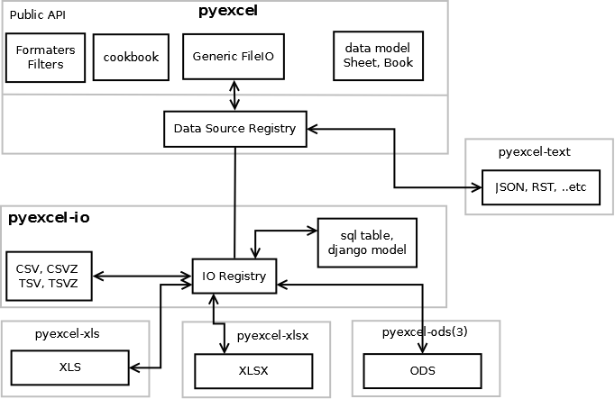

Developer's guide
=================

Here's the architecture of pyexcel

Pull requests are welcome.

Development steps for code changes

#. git clone https://github.com/pyexcel/pyexcel.git
#. cd pyexcel

Upgrade your setup tools and pip. They are needed for development and testing only:

#. pip install --upgrade setuptools "pip==7.1" 

Then install relevant development requirements:

#. pip install -r rnd_requirements.txt # if such a file exists
#. pip install -r requirements.txt
#. pip install -r tests/requirements.txt

In order to update test environment, and documentation, additional setps are
required:

#. pip install moban
#. git clone https://github.com/pyexcel/pyexcel-commons.git
#. make your changes in `.moban.d` directory, then issue command `moban`

What is rnd_requirements.txt
-------------------------------

Usually, it is created when a dependent library is not released. Once the dependecy is installed(will be released), the future version of the dependency in the requirements.txt will be valid.

What is pyexcel-commons
---------------------------------

Many information that are shared across pyexcel projects, such as: this developer guide, license info, etc. are stored in `pyexcel-commons` project.

What is .moban.d
---------------------------------

`.moban.d` stores the specific meta data for the library.

How to test your contribution
------------------------------

Although `nose` and `doctest` are both used in code testing, it is adviable that unit tests are put in tests. `doctest` is incorporated only to make sure the code examples in documentation remain valid across different development releases.

On Linux/Unix systems, please launch your tests like this::

    $ make test

On Windows systems, please issue this command::

    > test.bat

Acceptance criteria
-------------------

#. Has fair amount of documentation
#. Has Test cases written
#. Has all code lines tested
#. Passes all Travis CI builds
#. Pythonic code please
#. Agree on NEW BSD License for your contribution

