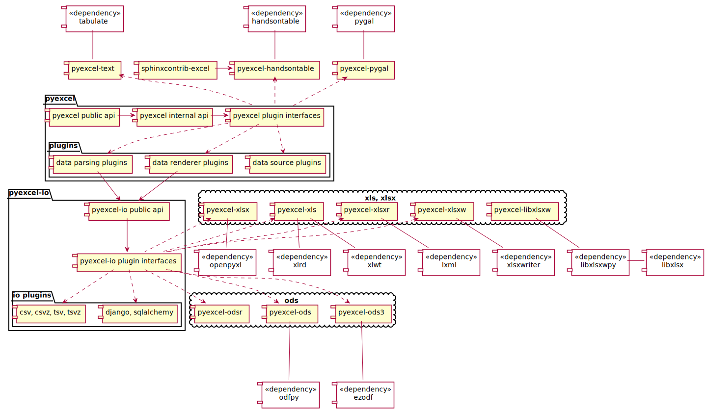

Architecture
===============

**pyexcel** uses loosely couple plugins to fullfil the promise to access
various file formats. **lml** is the plugin management library that
provide the specialized support for the loose coupling.

What is loose coupling?
-------------------------

The components of **pyexcel** is designed as building blocks. For your
project, you can cherry-pick the file format support without affecting
the core functionality of pyexcel. Each plugin will bring in additional
dependences. For example, if you choose pyexcel-xls, xlrd and xlwt will
be brought in as 2nd level depndencies.

Looking at the following architectural diagram, pyexcel is split into
different small packages.

